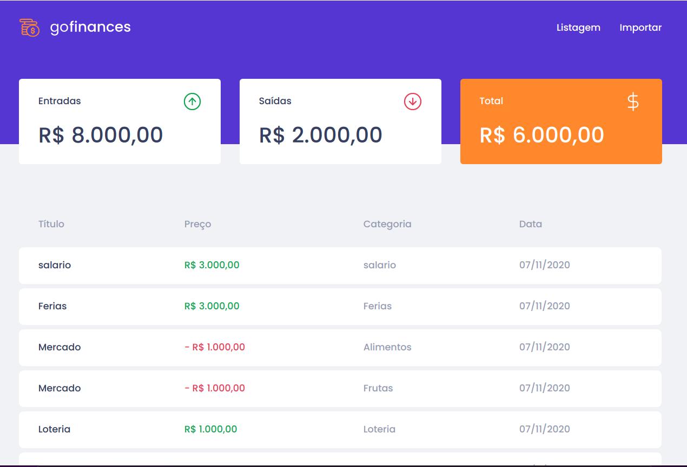

<h1>GoFinances</h1>

## 🚀 Tecnologias

Esse projeto foi desenvolvido com as seguintes tecnologias:

- [NodeJs]
- [PostgreSQL]
- [Docker]

## 💻 Projeto

Um backend para um projeto simples de controle financeiro.
  <h4>Features:</h4>
  <ul>
    <li>cadastro para as entradas financeiras</li>
    <li>cadastro para as saídas financeiras</li>
    <li>Categorização dos registros</li>
    <li>Totalização dos registros de entrada e saídas</li>
    <li>Balanço total (Entrada - saídas)</li>
  </ul>

## 🔖 Layout

## Licença

Esse projeto está sob a licença MIT.

